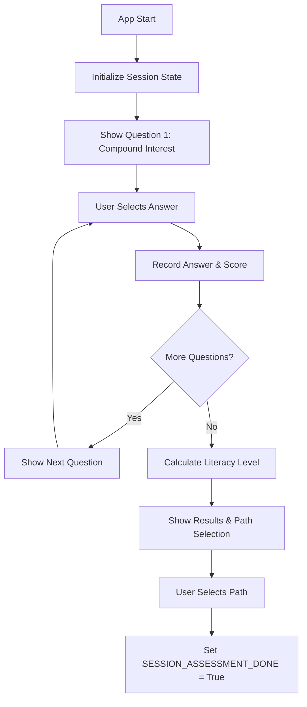
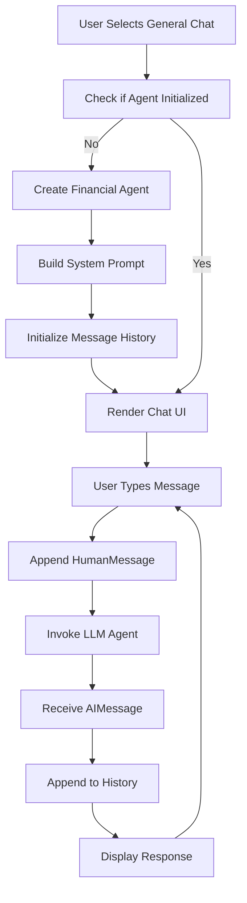
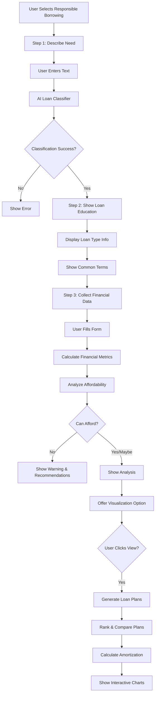

# Greek Financial Literacy Agent - Onboarding Documentation

**Version:** 1.0  
**Last Updated:** October 24, 2025

Welcome to the Greek Financial Literacy Agent codebase! This guide will help you understand the architecture, workflows, and implementation details of the system.

---

## Table of Contents

1. [System Overview](#system-overview)
2. [Core Workflows](#core-workflows)
3. [Service Layer Deep Dive](#service-layer-deep-dive)
4. [Data Models and Schemas](#data-models-and-schemas)
5. [Method Call Sequences](#method-call-sequences)
6. [UI Component Patterns](#ui-component-patterns)
7. [Calculations and Formulas](#calculations-and-formulas)

---

## System Overview

### Purpose

The Greek Financial Literacy Agent is a Streamlit-based web application that provides personalized financial education to Greek households. The system:

1. **Assesses** financial literacy using the validated Lusardi-Mitchell "Big 3" test
2. **Adapts** responses based on the user's literacy level
3. **Guides** users through complex financial decisions (like borrowing)
4. **Educates** with interactive visualizations and explanations

### Architecture Principles

#### 1. **Separation of Concerns**
- **UI Layer** (`src/finlit_agent/ui/`): Streamlit components, presentation logic
- **Service Layer** (`src/finlit_agent/services/`): Business logic, calculations
- **Agent Layer** (`src/finlit_agent/agents/`): AI-powered classification and reasoning
- **Data Layer** (`src/finlit_agent/database.py`): PostgreSQL persistence

#### 2. **Deterministic Assessment**
- Financial literacy scoring uses rule-based logic (no LLM guessing)
- Predictable, transparent results
- Validated internationally

#### 3. **Adaptive LLM Integration**
- Base system prompt + assessment context
- Responses tailored to user's level (Beginner/Intermediate/Advanced)
- Conversation history maintained

### Technology Stack

| Component | Technology | Purpose |
|-----------|------------|---------|
| **Frontend** | Streamlit 1.39+ | Web UI framework |
| **LLM Framework** | LangChain 1.0+ | AI agent orchestration |
| **LLM Model** | Google Gemini 2.5 Flash | Language model |
| **Database** | PostgreSQL 15 | Data persistence |
| **Visualization** | Plotly | Interactive charts |
| **Package Manager** | uv | Fast dependency management |

### Project Structure

```
greek-finlit-agent/
├── app.py                              # Main entry point & routing
├── src/finlit_agent/
│   ├── agent.py                        # LLM initialization
│   ├── database.py                     # PostgreSQL utilities
│   ├── literacy_assessment.py          # Big 3 assessment logic
│   │
│   ├── agents/                         # Specialized AI agents
│   │   └── loan_classifier.py         # Loan type classifier
│   │
│   ├── prompts/                        # LLM prompts
│   │   └── templates.py               # System prompts
│   │
│   ├── schemas/                        # Data structures
│   │   └── responses.py               # Structured outputs
│   │
│   ├── services/                       # Business logic (7 services)
│   │   ├── affordability_service.py
│   │   ├── amortization_service.py
│   │   ├── financial_calculator_service.py
│   │   ├── loan_comparison_service.py
│   │   ├── loan_information_service.py
│   │   ├── loan_plan_generator_service.py
│   │   └── visualization_data_service.py
│   │
│   └── ui/                             # Streamlit components
│       ├── assessment_ui.py           # Assessment screens
│       ├── chat_ui.py                 # Chat interface
│       ├── responsible_borrowing_ui.py # Loan workflow
│       ├── loan_visualization_ui.py   # Charts & graphs
│       ├── path_selection_ui.py       # Path chooser
│       ├── config.py                  # Constants
│       └── session_state.py           # State initialization
│
└── tests/                              # Test suite (75% coverage)
```

### Core Components

#### 1. Application Entry Point (`app.py`)

**Responsibilities:**
- Initialize database connection
- Set up Streamlit page configuration
- Initialize session state
- Route to appropriate screens based on state
- Render sidebar navigation

**Key Routing Logic:**
```python
if not st.session_state[config.SESSION_ASSESSMENT_DONE]:
    render_assessment()  # Show Big 3 questions
elif not st.session_state[config.SESSION_PATH_SELECTED]:
    render_path_selection()  # Choose workflow
elif st.session_state[config.SESSION_SELECTED_PATH] == "general_chat":
    render_chat()  # General financial Q&A
elif st.session_state[config.SESSION_SELECTED_PATH] == "responsible_borrowing":
    render_responsible_borrowing()  # Loan analysis workflow
```

#### 2. Financial Literacy Assessment (`literacy_assessment.py`)

**Purpose:** Implements the Lusardi-Mitchell "Big 3" test

**Key Class:** `FinancialLiteracyAssessment`

**The Big 3 Questions:**
1. **Compound Interest** - Understanding how money grows
2. **Inflation** - Impact on purchasing power
3. **Risk Diversification** - Investment safety principles

**Scoring Logic:**
```python
def _calculate_level(self, score: int) -> LiteracyLevel:
    if score >= 3:
        return LiteracyLevel.ADVANCED      # 3/3 correct
    elif score >= 2:
        return LiteracyLevel.INTERMEDIATE  # 2/3 correct
    else:
        return LiteracyLevel.BEGINNER      # 0-1/3 correct
```

**Why This Matters:**
The assessment result is used to adapt ALL subsequent LLM responses. A beginner gets simple explanations with basic terms, while an advanced user gets technical details and in-depth analysis.

#### 3. LLM Agent (`agent.py`)

**Purpose:** Initialize and configure the Gemini LLM

**Key Function:**
```python
def create_financial_agent():
    llm = ChatGoogleGenerativeAI(
        model="gemini-2.5-flash",
        temperature=0.7,  # Balanced creativity/consistency
        google_api_key=api_key
    )
    return llm
```

**System Prompt Structure:**
```
BASE_SYSTEM_PROMPT (Greek financial advisor persona)
+
ASSESSMENT CONTEXT (literacy level + weaknesses + instructions)
=
COMPLETE SYSTEM PROMPT
```

---

## Core Workflows

### Workflow 1: Financial Literacy Assessment

#### Purpose
Evaluate the user's financial knowledge using the internationally validated Big 3 test.

#### Entry Point
- **File:** `app.py`
- **Function:** `render_assessment()` (called from `assessment_ui.py`)
- **Trigger:** `st.session_state[SESSION_ASSESSMENT_DONE] == False`

#### User Journey



#### Detailed Execution Flow

**Step 1: Session Initialization**
- **File:** `session_state.py`
- **Function:** `initialize_session_state()`
- **Action:**
```python
st.session_state[SESSION_ASSESSMENT_DONE] = False
st.session_state[SESSION_CURRENT_QUESTION] = 0
st.session_state[SESSION_ASSESSMENT] = FinancialLiteracyAssessment()
```

**Step 2: Question Rendering**
- **File:** `assessment_ui.py`
- **Function:** `_render_question(question_index)`
- **Process:**
  1. Get question from `FinancialLiteracyAssessment.QUESTIONS[index]`
  2. Display question text
  3. Show radio buttons with options
  4. Wait for user to click "Επόμενο" (Next)

**Step 3: Answer Recording**
- **File:** `assessment_ui.py` → `literacy_assessment.py`
- **Function:** `assessment.record_answer(question_id, user_answer)`
- **Process:**
```python
def record_answer(self, question_id: int, user_answer: str) -> bool:
    question = self.QUESTIONS[question_id - 1]
    is_correct = (user_answer == question['correct'])
    
    if is_correct:
        self.score += 1  # Increment score
    
    # Store detailed answer data
    self.answers[question_id] = {
        'question': question['question'],
        'user_answer': user_answer,
        'correct_answer': question['correct'],
        'is_correct': is_correct,
        'explanation': question['explanation']
    }
    
    return is_correct
```

**Step 4: Level Calculation**
- **File:** `literacy_assessment.py`
- **Function:** `get_level()`
- **Logic:**
```python
# Deterministic scoring
if score >= 3:
    level = LiteracyLevel.ADVANCED      # "Προχωρημένο"
elif score >= 2:
    level = LiteracyLevel.INTERMEDIATE  # "Μέτριο"
else:
    level = LiteracyLevel.BEGINNER      # "Αρχάριο"
```

**Step 5: Context Generation**
- **File:** `literacy_assessment.py`
- **Function:** `get_context_summary()`
- **Output Example:**
```
ΕΠΙΠΕΔΟ ΟΙΚΟΝΟΜΙΚΟΥ ΕΓΓΡΑΜΜΑΤΙΣΜΟΥ: Μέτριο (2/3)

Αποτελέσματα Big 3 Assessment:
• Σκορ: 2/3 σωστές απαντήσεις
• Κατανοεί: Ανατοκισμός, Πληθωρισμός
• Χρειάζεται βοήθεια: Διαφοροποίηση Κινδύνου

ΟΔΗΓΙΕΣ ΠΡΟΣΑΡΜΟΓΗΣ:
- Χρησιμοποίησε απλή γλώσσα
- Εξήγησε νέες έννοιες όταν τις εισάγεις
- Δώσε πρακτικά παραδείγματα
```

**Step 6: Results Display**
- **File:** `assessment_ui.py`
- **Function:** `_render_results()`
- **UI Elements:**
  - Success message
  - Score metric (e.g., "Μέτριο 2/3")
  - Expandable sections with explanations
  - **Two path buttons:** General Chat | Responsible Borrowing

#### Data Transformations

```
User Input (a/b/c/d)
    ↓
Boolean (is_correct)
    ↓
Integer (score 0-3)
    ↓
Enum (LiteracyLevel.BEGINNER/INTERMEDIATE/ADVANCED)
    ↓
String (context_summary for LLM)
```

#### Key Files
- `app.py` (lines 59-60): Routing logic
- `assessment_ui.py` (lines 10-96): UI rendering
- `literacy_assessment.py` (lines 97-127): Answer recording
- `literacy_assessment.py` (lines 208-234): Context generation

---

### Workflow 2: General Chat

#### Purpose
Provide adaptive financial Q&A based on the user's assessed literacy level.

#### Entry Point
- **File:** `app.py`
- **Lines:** 63-70
- **Trigger:** User selects "💬 Γενικές Ερωτήσεις"

#### Execution Flow



#### Detailed Step-by-Step

**Step 1: Agent Initialization** (First time only)
- **File:** `app.py`
- **Lines:** 65-69
```python
if st.session_state[config.SESSION_AGENT] is None:
    # Create agent
    agent = create_financial_agent()
    
    # Build enhanced system prompt
    system_prompt = (
        BASE_SYSTEM_PROMPT +  # Base Greek advisor persona
        st.session_state[config.SESSION_ASSESSMENT].get_context_summary()  # + Assessment context
    )
    
    # Store in session
    st.session_state[config.SESSION_AGENT] = agent
    st.session_state[config.SESSION_MESSAGES] = [SystemMessage(content=system_prompt)]
```

**Step 2: Chat Rendering**
- **File:** `chat_ui.py`
- **Function:** `render_chat()`
```python
def render_chat() -> None:
    _display_chat_history()  # Show past messages
    _handle_chat_input()      # Handle new input
```

**Step 3: Message Display**
- **Function:** `_display_chat_history()`
- **Process:**
```python
messages = st.session_state[SESSION_MESSAGES]

for msg in messages:
    if isinstance(msg, HumanMessage):
        with st.chat_message("user"):
            st.write(msg.content)
    elif isinstance(msg, AIMessage):
        with st.chat_message("assistant"):
            st.write(msg.content)
    # SystemMessage is skipped (internal context)
```

**Step 4: User Input Handling**
- **Function:** `_handle_chat_input()`
```python
if prompt := st.chat_input(CHAT_INPUT_PLACEHOLDER):
    _process_user_message(prompt)
```

**Step 5: Message Processing**
- **Function:** `_process_user_message(prompt)`
```python
# 1. Add user message to history
messages = st.session_state[SESSION_MESSAGES]
messages.append(HumanMessage(content=prompt))

# 2. Display user message immediately
with st.chat_message("user"):
    st.write(prompt)

# 3. Generate agent response
_generate_agent_response(messages)
```

**Step 6: LLM Invocation**
- **Function:** `_generate_agent_response(messages)`
```python
agent = st.session_state[SESSION_AGENT]

with st.chat_message("assistant"):
    with st.spinner(THINKING_SPINNER):
        try:
            # Invoke LLM with full message history
            response = agent.invoke(messages)
            
            # Display response
            st.write(response.content)
            
            # Append to history
            messages.append(AIMessage(content=response.content))
            
        except Exception as e:
            st.error(f"Σφάλμα: {str(e)}")
            messages.pop()  # Remove failed user message
```

#### Message Flow

```
User: "Πώς μπορώ να αποταμιεύσω χρήματα;"

    ↓ Convert to LangChain message

HumanMessage(content="Πώς μπορώ να αποταμιεύσω χρήματα;")

    ↓ Add to message list

[
    SystemMessage("...base prompt + assessment context..."),
    HumanMessage("Πώς μπορώ να αποταμιεύσω χρήματα;")
]

    ↓ Send to Gemini

agent.invoke(messages)

    ↓ Receive response (adapted to user's level)

AIMessage(content="Για να αποταμιεύσεις...")

    ↓ Append to history & display

[SystemMessage(...), HumanMessage(...), AIMessage(...)]
```

#### Key Adaptation Behavior

**For Beginner (0-1/3):**
```
ΟΔΗΓΙΕΣ ΠΡΟΣΑΡΜΟΓΗΣ:
- Χρησιμοποίησε ΠΟΛΥ απλή γλώσσα
- Εξήγησε ΟΛΕΣ τις βασικές έννοιες
- Δώσε συγκεκριμένα παραδείγματα με αριθμούς
- Απόφυγε τεχνικούς όρους
```

**For Advanced (3/3):**
```
ΟΔΗΓΙΕΣ ΠΡΟΣΑΡΜΟΓΗΣ:
- Μπορείς να χρησιμοποιήσεις οικονομικούς όρους
- Πήγαινε σε βάθος στην ανάλυση
- Εστίασε σε προχωρημένα θέματα
```

#### Key Files
- `app.py` (lines 63-70): Agent initialization
- `chat_ui.py` (lines 17-72): Chat UI logic
- `agent.py` (lines 13-36): Agent creation

---

### Workflow 3: Responsible Borrowing

#### Purpose
Guide users through loan decisions with AI classification, education, analysis, and visualizations.

#### Entry Point
- **File:** `app.py`
- **Line:** 72
- **Trigger:** User selects "🏠 Υπεύθυνος Δανεισμός"

#### Complete User Journey



#### Sub-Process 1: Loan Classification

**Purpose:** Use AI to determine what type of loan the user needs

**Entry Point:**
- **File:** `responsible_borrowing_ui.py`
- **Function:** `_ask_user_need()` → `_classify_and_save(user_input)`

**Process:**
```python
def _classify_and_save(user_input: str):
    # 1. Create classifier agent
    agent = create_loan_classifier_agent()
    
    # 2. Classify the request
    result = classify_loan_request(agent, user_input)
    
    # 3. Save to session state
    if result["success"]:
        st.session_state["rb_loan_type"] = result["loan_type"]
        st.session_state["rb_confidence"] = result["confidence"]
        st.session_state["rb_reasoning"] = result["reasoning"]
        st.rerun()
```

**Classifier Agent:**
- **File:** `loan_classifier.py`
- **Model:** `gemini-2.5-flash-lite` (fast, low cost)
- **Temperature:** 0.3 (consistent classification)
- **Output:** Structured `LoanClassificationResponse`

**Loan Categories:**
- `mortgage` - Home buying, refinancing
- `personal` - General purpose, emergencies
- `auto` - Vehicle purchase
- `student` - Education costs
- `business` - Business expansion
- `unknown` - Cannot determine

**Example Classification:**
```
Input: "Θέλω να αγοράσω το πρώτο μου σπίτι"
Output: {
    "loan_type": "mortgage",
    "confidence": 0.95,
    "reasoning": "User explicitly mentions buying first home",
    "next_question": null
}
```

#### Sub-Process 2: Educational Content

**Purpose:** Teach user about the loan type before collecting data

**File:** `responsible_borrowing_ui.py` → `loan_information_service.py`

**Service Method:**
```python
def get_loan_explanation(self, loan_type: str) -> Dict:
    return {
        "title": "Στεγαστικό Δάνειο",
        "description": "Τι είναι και πώς λειτουργεί",
        "key_points": "Βασικά χαρακτηριστικά",
        "tip": "Συμβουλές",
        "example": "Παράδειγμα υπολογισμού"
    }
```

**What's Displayed:**
1. Loan type name in Greek
2. Simple explanation
3. Key characteristics (duration, rates, requirements)
4. Tips and warnings
5. Real-world example with numbers
6. Common financial terms explained

#### Sub-Process 3: Financial Data Collection

**Purpose:** Gather user's financial situation

**File:** `responsible_borrowing_ui.py`
**Function:** `_show_financial_form()`

**Data Collected:**
```python
financial_data = {
    "monthly_income": float,      # Net salary
    "other_income": float,        # Rent, dividends
    "monthly_expenses": float,    # Living costs
    "existing_loans": float,      # Current loan payments
    "savings": float,             # Available savings
    "loan_amount": float          # Desired loan amount
}
```

**Streamlit Form:**
- 2-column layout for income/expenses
- Number inputs with validation
- Help text for each field
- Submit button triggers analysis

#### Sub-Process 4: Financial Analysis

**Purpose:** Calculate metrics and determine affordability

**Services Used:**
1. `FinancialCalculatorService` - Calculate all metrics
2. `AffordabilityService` - Analyze and recommend

**Metrics Calculation:**

**File:** `financial_calculator_service.py`
**Method:** `calculate_financial_metrics(financial_data)`

```python
# Step 1: Calculate totals
total_income = monthly_income + other_income
total_expenses = monthly_expenses + existing_loans
disposable_income = total_income - total_expenses

# Step 2: Estimate monthly payment (default: 5 years @ 5%)
estimated_payment = calculate_monthly_payment(
    principal=loan_amount,
    annual_rate=0.05,
    years=5
)

# Step 3: Calculate payment ratio
payment_ratio = (estimated_payment / monthly_income) * 100

return {
    "total_income": total_income,
    "total_expenses": total_expenses,
    "disposable_income": disposable_income,
    "estimated_payment": estimated_payment,
    "payment_ratio": payment_ratio
}
```

**Affordability Determination:**

**File:** `affordability_service.py`
**Method:** `get_affordability_status(payment_ratio, disposable_income, estimated_payment)`

```python
# Safe: Payment ratio ≤ 30%
if ratio <= 30.0:
    return "safe"

# Warning: 30% < ratio ≤ 40%
elif ratio <= 40.0:
    return "warning"

# Danger: ratio > 40% OR no disposable income
else:
    return "danger"
```

**Recommendations Generated:**

**Danger Status:**
- "Προσοχή! Τα έξοδά σου ξεπερνούν το εισόδημά σου"
- Suggestions to reduce expenses or increase income
- Consider smaller loan amount

**Warning Status:**
- "Η δόση είναι στο όριο του ασφαλούς"
- Consider longer term (lower payment, more interest)
- Be cautious

**Safe Status:**
- "Καλά νέα! Έχεις περιθώριο για αυτό το δάνειο"
- Keep buffer for emergencies
- Compare multiple bank offers

#### Sub-Process 5: Loan Plan Generation

**Purpose:** Create multiple loan options with different terms

**File:** `loan_plan_generator_service.py`
**Method:** `generate_loan_options(total_amount, loan_type, monthly_income)`

**Process:**
```python
# 1. Get default interest rate for loan type
interest_rate = DEFAULT_RATES[loan_type]
# mortgage: 3.5%, personal: 7%, auto: 5%, etc.

# 2. Get term options
term_options = TERM_OPTIONS[loan_type]
# mortgage: [15, 20, 25, 30], personal: [3, 5, 7], etc.

# 3. Generate plans for each term
for term in term_options:
    # For mortgages, vary down payment too
    if loan_type == "mortgage":
        for down_pct in [0.10, 0.15, 0.20]:
            plan = create_loan_plan(
                total_amount, down_pct, interest_rate, 
                term, monthly_income
            )
            plans.append(plan)
    else:
        # Other loans: no down payment
        plan = create_loan_plan(
            total_amount, 0.0, interest_rate, 
            term, monthly_income
        )
        plans.append(plan)

return plans  # 5-12 different options
```

**Each LoanPlan Contains:**
- Unique ID
- Descriptive name (e.g., "Ισορροπημένο (20 έτη) - Άνετο")
- Loan amount (after down payment)
- Term in years
- Interest rate
- Down payment amount and percentage
- Monthly payment
- Total interest over life of loan
- Total cost (principal + interest + down payment)
- Payment-to-income ratio

#### Sub-Process 6: Plan Ranking & Comparison

**Purpose:** Score and rank all plans by multiple criteria

**File:** `loan_comparison_service.py`
**Method:** `rank_loan_plans(plans, financial_data, preferences)`

**Scoring Algorithm:**

Each plan receives 5 scores (0-100):

1. **Affordability Score (30% weight)**
   ```python
   if payment_ratio <= 30:
       score = 100  # Excellent
   elif payment_ratio <= 40:
       score = 100 - ((ratio - 30) / 10 * 50)  # 100 to 50
   else:
       score = max(0, 50 - ((ratio - 40) * 2))  # Decreasing
   ```

2. **Cost Score (25% weight)**
   - Lower total cost = higher score
   - Relative to other plans

3. **Payment Score (20% weight)**
   - Lower monthly payment = higher score
   - Relative to other plans

4. **Term Score (15% weight)**
   - 15-20 years = optimal (100 points)
   - Shorter or longer = fewer points

5. **Flexibility Score (10% weight)**
   - Based on term and payment ratio
   - Shorter term + lower ratio = more flexible

**Overall Score:**
```python
overall = (
    affordability * 0.30 +
    cost * 0.25 +
    payment * 0.20 +
    term * 0.15 +
    flexibility * 0.10
)
```

**Best Plans Selection:**
```python
def select_best_plans(ranked_plans, count=2):
    # Always include top-ranked
    selected = [ranked_plans[0].plan]
    
    # For remaining, prefer diversity
    # (at least 5 years term difference, 15% payment difference)
    for rp in ranked_plans[1:]:
        if is_diverse_from_selected(rp.plan, selected):
            selected.append(rp.plan)
            if len(selected) >= count:
                break
    
    return selected
```

#### Sub-Process 7: Amortization Calculation

**Purpose:** Calculate month-by-month payment breakdown

**File:** `amortization_service.py`
**Method:** `calculate_amortization_schedule(loan_amount, rate, term_years)`

**Formula:**
```
Monthly Payment = P * [r(1+r)^n] / [(1+r)^n - 1]

Where:
P = Principal (loan amount)
r = Monthly interest rate (annual / 12)
n = Total payments (years * 12)
```

**For Each Month:**
```python
for month in range(1, term_months + 1):
    # Interest this month = remaining balance * monthly rate
    interest_payment = remaining_balance * monthly_rate
    
    # Principal this month = total payment - interest
    principal_payment = monthly_payment - interest_payment
    
    # Update balance
    remaining_balance -= principal_payment
    cumulative_interest += interest_payment
    
    # Store period
    periods.append(PaymentPeriod(
        period=month,
        payment=monthly_payment,
        principal=principal_payment,
        interest=interest_payment,
        remaining_balance=remaining_balance,
        cumulative_interest=cumulative_interest
    ))
```

**Output:** `AmortizationSchedule` with all 360 monthly periods (for 30-year loan)

**Schedule Aggregation:**
```python
# Aggregate into yearly summaries for visualization
summary = get_schedule_summary(schedule, interval='yearly')
# Returns: [Year 1, Year 2, ..., Year 30]
# Each with: principal_paid, interest_paid, remaining_balance
```

#### Sub-Process 8: Visualization

**Purpose:** Display interactive charts for loan comparison

**File:** `loan_visualization_ui.py`

**Visualizations Provided:**

1. **Plan Comparison Cards**
   - Side-by-side display of 2 best plans
   - Key metrics: monthly payment, term, total cost, total interest
   - Color-coded affordability (green/yellow/red)

2. **Principal vs Interest Chart** (Area chart)
   - Shows yearly breakdown
   - Blue = principal paid
   - Pink = interest paid
   - Demonstrates how interest front-loads

3. **Remaining Balance Chart** (Line chart)
   - Shows loan balance over time
   - Orange declining curve
   - Demonstrates payoff progress

4. **Payment Breakdown** (Pie charts)
   - First payment vs last payment
   - Shows interest % vs principal %
   - Highlights the shift over time

5. **Comparison Bar Chart**
   - Multiple metrics side-by-side
   - Monthly payment, total cost, total interest, term
   - Easy visual comparison

**Data Preparation:**
- **File:** `visualization_data_service.py`
- **Purpose:** Transform amortization data into Plotly-ready format

```python
def prepare_amortization_chart_data(schedule, interval='yearly'):
    summary = amortization_service.get_schedule_summary(schedule, interval)
    
    return ChartData(
        title="Πληρωμές Κεφαλαίου και Τόκων",
        labels=[point.label for point in summary],
        datasets=[
            Dataset(
                label="Κεφάλαιο",
                data=[point.principal_paid for point in summary],
                color='#2E86AB'
            ),
            Dataset(
                label="Τόκοι",
                data=[point.interest_paid for point in summary],
                color='#A23B72'
            )
        ],
        x_label="Χρόνος",
        y_label="Ποσό (€)"
    )
```

#### Key Files
- `responsible_borrowing_ui.py`: Main workflow orchestration
- `loan_classifier.py`: AI classification
- `loan_information_service.py`: Educational content
- `financial_calculator_service.py`: Metrics calculation
- `affordability_service.py`: Analysis & recommendations
- `loan_plan_generator_service.py`: Plan creation
- `loan_comparison_service.py`: Ranking & selection
- `amortization_service.py`: Schedule calculation
- `visualization_data_service.py`: Chart data prep
- `loan_visualization_ui.py`: Chart rendering

---

## Service Layer Deep Dive

### 1. Financial Calculator Service

**File:** `src/finlit_agent/services/financial_calculator_service.py`

**Purpose:** Pure calculation logic for financial metrics (no UI dependencies)

#### Key Methods

**Calculate Monthly Payment**
```python
def calculate_monthly_payment(principal, annual_rate, years):
    """
    Amortization formula for fixed-rate loans.
    
    Returns monthly payment amount.
    """
    if annual_rate == 0:
        return principal / (years * 12)
    
    monthly_rate = annual_rate / 12
    num_payments = years * 12
    
    payment = principal * (
        monthly_rate * (1 + monthly_rate) ** num_payments
    ) / (
        (1 + monthly_rate) ** num_payments - 1
    )
    
    return payment
```

**Example:**
- Loan: €10,000
- Rate: 5% annual (0.05)
- Term: 5 years
- **Result:** €188.71/month

**Calculate Financial Metrics (Complete Analysis)**
```python
def calculate_financial_metrics(financial_data):
    # 1. Income
    total_income = monthly_income + other_income
    
    # 2. Expenses
    total_expenses = monthly_expenses + existing_loans
    
    # 3. Disposable
    disposable_income = total_income - total_expenses
    
    # 4. Estimated payment (5 years @ 5% default)
    estimated_payment = calculate_monthly_payment(
        loan_amount, 0.05, 5
    )
    
    # 5. Payment ratio
    payment_ratio = (estimated_payment / monthly_income) * 100
    
    return all_metrics
```

**Why This Matters:** This service is the foundation for all financial decision-making. The payment ratio calculation directly determines affordability recommendations.

---

### 2. Affordability Service

**File:** `src/finlit_agent/services/affordability_service.py`

**Purpose:** Analyze loan affordability and generate personalized recommendations

#### Thresholds

```python
SAFE_PAYMENT_RATIO = 30.0       # ≤ 30% is safe
WARNING_PAYMENT_RATIO = 40.0    # 30-40% is risky
MINIMUM_SAVINGS_RATIO = 0.1     # Should have 10% saved
```

**These are based on financial industry best practices.**

#### Status Determination Logic

```python
def get_affordability_status(payment_ratio, disposable_income, estimated_payment):
    # Red flags
    if disposable_income <= 0:
        return "danger"  # No money left after expenses
    
    if payment_ratio > 40:
        return "danger"  # Payment too high relative to income
    
    if disposable_income < estimated_payment:
        return "danger"  # Can't afford the payment
    
    # Caution zone
    if payment_ratio > 30:
        return "warning"  # At the edge of safe
    
    # All good
    return "safe"
```

#### Recommendation Generation

The service generates context-aware recommendations in Greek:

**For Danger Status:**
```python
recommendations = [
    "**Προσοχή!** Τα έξοδά σου ξεπερνούν το εισόδημά σου.\n"
    "Πριν πάρεις δάνειο, καλό θα ήταν:\n"
    "- Να μειώσεις τα έξοδά σου\n"
    "- Να αυξήσεις το εισόδημά σου\n"
    "- Να ξεπληρώσεις υπάρχοντα δάνεια"
]
```

**For Safe Status:**
```python
recommendations = [
    "**Καλά νέα!** Φαίνεται ότι έχεις περιθώριο.\n"
    "Θυμήσου:\n"
    "- Αυτή είναι μια εκτίμηση\n"
    "- Κράτα buffer για έκτακτα\n"
    "- Σύγκρινε προσφορές"
]
```

---

### 3. Loan Plan Generator Service

**File:** `src/finlit_agent/services/loan_plan_generator_service.py`

**Purpose:** Generate multiple loan options with varying parameters

#### Default Interest Rates

```python
DEFAULT_RATES = {
    "mortgage": 0.035,   # 3.5% - secured by property
    "personal": 0.07,    # 7% - unsecured, higher risk
    "auto": 0.05,        # 5% - secured by vehicle
    "student": 0.04,     # 4% - government-backed
    "business": 0.06,    # 6% - depends on business
    "unknown": 0.06      # 6% - default
}
```

#### Term Options by Loan Type

```python
TERM_OPTIONS = {
    "mortgage": [15, 20, 25, 30],  # Long-term
    "personal": [3, 5, 7],         # Short-term
    "auto": [3, 5, 7],             # Medium-term
    "student": [10, 15, 20],       # Long-term
    "business": [5, 10, 15],       # Medium-term
}
```

#### Plan Naming Algorithm

```python
def _generate_plan_name(term_years, down_payment_pct, payment_ratio):
    # Classify by term
    if term_years <= 10:
        term_desc = "Γρήγορη Αποπληρωμή"  # Fast payoff
    elif term_years <= 20:
        term_desc = "Ισορροπημένο"         # Balanced
    else:
        term_desc = "Μακροπρόθεσμο"        # Long-term
    
    # Classify by affordability
    if payment_ratio <= 25:
        affordability = "Άνετο"     # Comfortable
    elif payment_ratio <= 35:
        affordability = "Μέτριο"    # Moderate
    else:
        affordability = "Απαιτητικό" # Demanding
    
    return f"{term_desc} ({term_years} έτη) - {affordability}"
```

**Example Output:**
- "Γρήγορη Αποπληρωμή (10 έτη) - Απαιτητικό"
- "Ισορροπημένο (20 έτη) - Άνετο"
- "Μακροπρόθεσμο (30 έτη) - Μέτριο"

---

### 4. Loan Comparison Service

**File:** `src/finlit_agent/services/loan_comparison_service.py`

**Purpose:** Rank loan plans using multi-criteria scoring

#### Scoring Weights

```python
AFFORDABILITY_WEIGHT = 0.30  # 30% - Most important
COST_WEIGHT = 0.25           # 25% - Total cost matters
PAYMENT_WEIGHT = 0.20        # 20% - Monthly payment
TERM_WEIGHT = 0.15           # 15% - Loan duration
FLEXIBILITY_WEIGHT = 0.10    # 10% - Future flexibility
```

**Why these weights?**
- Affordability is #1: You must be able to pay
- Total cost is #2: You want to minimize interest
- Monthly payment is #3: Affects daily budget
- Term and flexibility are lower: Personal preference

#### Individual Scoring Functions

**Affordability Score:**
```python
def _score_affordability(plan):
    ratio = plan.payment_to_income_ratio
    
    if ratio <= 30:
        return 100.0  # Perfect
    elif ratio <= 40:
        # Linear decline from 100 to 50
        return 100 - ((ratio - 30) / 10 * 50)
    else:
        # Exponential decline below 50
        excess = ratio - 40
        return max(0, 50 - (excess * 2))
```

**Cost Score:**
```python
def _score_cost(plan, all_plans):
    costs = [p.total_cost for p in all_plans]
    min_cost = min(costs)
    max_cost = max(costs)
    
    # Lowest cost = 100, highest = 0
    score = 100 - ((plan.total_cost - min_cost) / (max_cost - min_cost) * 100)
    return score
```

#### Diversity Selection

```python
def _is_diverse_from_selected(plan, selected):
    for selected_plan in selected:
        # Check term diversity (at least 5 years different)
        if abs(plan.term_years - selected_plan.term_years) < 5:
            return False
        
        # Check payment diversity (at least 15% different)
        payment_diff_pct = abs(
            plan.monthly_payment - selected_plan.monthly_payment
        ) / selected_plan.monthly_payment * 100
        
        if payment_diff_pct < 15:
            return False
    
    return True
```

**Why diversity matters:** Users benefit from seeing contrasting options (e.g., short-term/high-payment vs long-term/low-payment).

---

### 5. Amortization Service

**File:** `src/finlit_agent/services/amortization_service.py`

**Purpose:** Calculate detailed payment schedules

#### Core Calculation

```python
def calculate_amortization_schedule(loan_amount, annual_rate, term_years):
    monthly_rate = annual_rate / 12
    term_months = term_years * 12
    
    # Monthly payment (fixed)
    monthly_payment = calculate_using_formula()
    
    # Calculate each month
    remaining_balance = loan_amount
    cumulative_interest = 0.0
    periods = []
    
    for month in range(1, term_months + 1):
        # Interest for THIS month
        interest_payment = remaining_balance * monthly_rate
        
        # Principal for THIS month
        principal_payment = monthly_payment - interest_payment
        
        # Update balances
        cumulative_interest += interest_payment
        remaining_balance -= principal_payment
        
        # Store period data
        periods.append(PaymentPeriod(...))
    
    return AmortizationSchedule(periods=periods, ...)
```

**Key Insight:** In early months, most payment goes to interest. In later months, most goes to principal.

**Example (€100,000 @ 5% for 30 years):**
- Month 1: €416.67 interest, €120.03 principal
- Month 180: €277.78 interest, €258.92 principal
- Month 360: €2.23 interest, €534.47 principal

#### Schedule Aggregation

```python
def get_schedule_summary(schedule, interval='yearly'):
    if interval == 'yearly':
        group_size = 12
    elif interval == 'quarterly':
        group_size = 3
    else:  # monthly
        group_size = 1
    
    summary_points = []
    
    for i in range(0, len(schedule.periods), group_size):
        group = schedule.periods[i:i + group_size]
        
        # Sum up this period
        principal_paid = sum(p.principal for p in group)
        interest_paid = sum(p.interest for p in group)
        
        summary_points.append(SchedulePoint(
            label=f"Year {year}",
            principal_paid=principal_paid,
            interest_paid=interest_paid,
            remaining_balance=group[-1].remaining_balance
        ))
    
    return summary_points
```

**Purpose:** Reduce 360 monthly data points to 30 yearly points for cleaner charts.

---

### 6. Visualization Data Service

**File:** `src/finlit_agent/services/visualization_data_service.py`

**Purpose:** Transform calculation data into Plotly-ready format

#### Data Models

```python
@dataclass
class Dataset:
    label: str          # "Κεφάλαιο", "Τόκοι"
    data: List[float]   # Y-axis values
    color: str          # Hex color code

@dataclass
class ChartData:
    title: str
    labels: List[str]        # X-axis labels
    datasets: List[Dataset]  # Multiple series
    x_label: str
    y_label: str
```

#### Chart Preparation Methods

**Amortization Chart:**
```python
def prepare_amortization_chart_data(schedule, interval):
    summary = get_schedule_summary(schedule, interval)
    
    return ChartData(
        title="Πληρωμές Κεφαλαίου και Τόκων",
        labels=["Year 1", "Year 2", ...],
        datasets=[
            Dataset(
                label="Κεφάλαιο",
                data=[10234.56, 10456.78, ...],
                color='#2E86AB'  # Blue
            ),
            Dataset(
                label="Τόκοι",
                data=[5234.56, 4987.23, ...],
                color='#A23B72'  # Pink
            )
        ],
        x_label="Χρόνος",
        y_label="Ποσό (€)"
    )
```

**Comparison Chart:**
```python
def prepare_comparison_chart_data(plans):
    return ChartData(
        title="Σύγκριση Σχεδίων Δανείου",
        labels=["Σχέδιο A", "Σχέδιο B"],
        datasets=[
            Dataset(
                label="Μηνιαία Δόση",
                data=[plan_a.monthly_payment, plan_b.monthly_payment],
                color='#F18F01'
            ),
            Dataset(
                label="Συνολικό Κόστος",
                data=[plan_a.total_cost, plan_b.total_cost],
                color='#2E86AB'
            ),
            # ... more metrics
        ]
    )
```

---

### 7. Loan Information Service

**File:** `src/finlit_agent/services/loan_information_service.py`

**Purpose:** Provide educational content about loan types (all in Greek)

#### Content Structure

```python
def get_loan_explanation(loan_type):
    return {
        "title": "Στεγαστικό Δάνειο",
        "description": "Τι είναι και πώς λειτουργεί",
        "key_points": """
            - Διάρκεια: 15-30 χρόνια
            - Προκαταβολή: 10-20%
            - Τόκος: Σχετικά χαμηλός
        """,
        "tip": "Μην ξεπερνάς το 30% του εισοδήματός σου!",
        "example": "Παράδειγμα με αριθμούς..."
    }
```

**Loan Types Covered:**
- Στεγαστικό (Mortgage)
- Προσωπικό (Personal)
- Αυτοκινήτου (Auto)
- Φοιτητικό (Student)
- Επιχειρηματικό (Business)

**Common Terms Explained:**
- Επιτόκιο (Interest Rate)
- Δόση (Installment)
- Διάρκεια (Term)
- ΤΑΕ (APR)

---

## Data Models and Schemas

### 1. LoanClassificationResponse

**File:** `src/finlit_agent/schemas/responses.py`

```python
@dataclass
class LoanClassificationResponse:
    loan_type: str            # mortgage, personal, auto, student, business, unknown
    confidence: float         # 0.0 to 1.0
    reasoning: str           # Brief explanation
    next_question: str | None # Optional clarifying question
```

**Usage:** Structured output from the loan classifier agent

**Example:**
```python
LoanClassificationResponse(
    loan_type="mortgage",
    confidence=0.92,
    reasoning="User wants to buy a house",
    next_question=None
)
```

---

### 2. LoanPlan

**File:** `src/finlit_agent/services/loan_plan_generator_service.py`

```python
@dataclass
class LoanPlan:
    id: str                          # Unique identifier
    name: str                        # "Ισορροπημένο (20 έτη) - Άνετο"
    amount: float                    # Loan amount (after down payment)
    term_years: int                  # Duration in years
    interest_rate: float             # Annual rate as decimal (0.05 = 5%)
    down_payment: float              # Down payment amount
    down_payment_percentage: float   # Down payment as percentage
    monthly_payment: float           # Monthly payment amount
    total_interest: float            # Total interest over life of loan
    total_cost: float                # Total: principal + interest + down payment
    payment_to_income_ratio: float   # As percentage (e.g., 28.5)
```

**Example:**
```python
LoanPlan(
    id="a3b2c1d4",
    name="Ισορροπημένο (20 έτη) - Άνετο",
    amount=80000.0,
    term_years=20,
    interest_rate=0.035,
    down_payment=20000.0,
    down_payment_percentage=20.0,
    monthly_payment=463.64,
    total_interest=31273.60,
    total_cost=131273.60,
    payment_to_income_ratio=23.18
)
```

---

### 3. RankedPlan

**File:** `src/finlit_agent/services/loan_comparison_service.py`

```python
@dataclass
class RankedPlan:
    plan: LoanPlan                  # The loan plan
    score: float                    # Overall score (0-100)
    affordability_score: float      # Affordability component (0-100)
    cost_score: float               # Cost component (0-100)
    payment_score: float            # Payment component (0-100)
    term_score: float               # Term component (0-100)
    recommendation_reason: str      # "Πολύ προσιτό, Χαμηλό κόστος"
```

**Purpose:** Wraps a LoanPlan with its ranking scores

---

### 4. AmortizationSchedule

**File:** `src/finlit_agent/services/amortization_service.py`

```python
@dataclass
class AmortizationSchedule:
    loan_amount: float              # Principal
    interest_rate: float            # Annual rate
    term_months: int                # Total months
    monthly_payment: float          # Fixed monthly payment
    periods: List[PaymentPeriod]    # Month-by-month breakdown
    total_interest: float           # Sum of all interest
    total_payments: float           # Sum of all payments
```

**Contains:** Complete payment schedule with all periods

---

### 5. PaymentPeriod

**File:** `src/finlit_agent/services/amortization_service.py`

```python
@dataclass
class PaymentPeriod:
    period: int                     # Month number (1-based)
    payment: float                  # Total payment this month
    principal: float                # Principal portion
    interest: float                 # Interest portion
    remaining_balance: float        # Balance after payment
    cumulative_interest: float      # Total interest paid so far
```

**Example (Month 1 of €100k @ 5% for 30 years):**
```python
PaymentPeriod(
    period=1,
    payment=536.82,
    principal=120.15,
    interest=416.67,
    remaining_balance=99879.85,
    cumulative_interest=416.67
)
```

---

### 6. SchedulePoint

**File:** `src/finlit_agent/services/amortization_service.py`

```python
@dataclass
class SchedulePoint:
    label: str                      # "Year 1", "Q2", "Month 12"
    period_end: int                 # Last month of this period
    principal_paid: float           # Principal in this period
    interest_paid: float            # Interest in this period
    remaining_balance: float        # Balance at end
    cumulative_interest: float      # Total interest to date
```

**Purpose:** Aggregated data for visualization (monthly → yearly)

---

### 7. ComparisonResult

**File:** `src/finlit_agent/services/loan_comparison_service.py`

```python
@dataclass
class ComparisonResult:
    plan_a: LoanPlan
    plan_b: LoanPlan
    winner: str                     # 'a', 'b', or 'tie'
    monthly_payment_diff: float     # Difference in monthly payment
    total_cost_diff: float          # Difference in total cost
    interest_diff: float            # Difference in total interest
    term_diff: int                  # Difference in years
    pros_plan_a: List[str]          # Advantages of plan A
    pros_plan_b: List[str]          # Advantages of plan B
    recommendation: str             # Overall recommendation
```

**Purpose:** Detailed side-by-side comparison of two plans

---

### 8. ChartData & Dataset

**File:** `src/finlit_agent/services/visualization_data_service.py`

```python
@dataclass
class Dataset:
    label: str          # "Κεφάλαιο", "Τόκοι"
    data: List[float]   # Y-axis values
    color: str          # Hex color code

@dataclass
class ChartData:
    title: str
    labels: List[str]        # X-axis labels
    datasets: List[Dataset]  # Multiple data series
    x_label: str
    y_label: str
```

**Purpose:** Plotly-ready data structure for charts

---

## Method Call Sequences

### Sequence 1: Complete Assessment Flow

```python
# 1. App Initialization
app.py: main()
    ↓
database.py: check_db_connection()
database.py: init_db()
    ↓
session_state.py: initialize_session_state()
    • Creates FinancialLiteracyAssessment() instance
    • Sets SESSION_ASSESSMENT_DONE = False
    ↓

# 2. Assessment Rendering
app.py: if not SESSION_ASSESSMENT_DONE
    ↓
assessment_ui.py: render_assessment()
    ↓
assessment_ui.py: _render_question(question_index)
    • Gets question from QUESTIONS[index]
    • Displays radio buttons
    • Waits for user input
    ↓

# 3. Answer Processing (User clicks "Επόμενο")
assessment_ui.py: on button click
    ↓
literacy_assessment.py: assessment.record_answer(question_id, user_answer)
    • Checks if answer == correct_answer
    • Increments score if correct
    • Stores answer details in self.answers
    • Returns is_correct boolean
    ↓
assessment_ui.py: Increment SESSION_CURRENT_QUESTION
assessment_ui.py: st.rerun()
    ↓

# 4. Results Display (After all 3 questions)
assessment_ui.py: _render_results()
    ↓
literacy_assessment.py: assessment.get_level()
    • Returns LiteracyLevel enum based on score
    ↓
literacy_assessment.py: assessment.get_level_name()
    • Returns Greek name: "Αρχάριο", "Μέτριο", "Προχωρημένο"
    ↓
assessment_ui.py: Display results with path buttons
    • Show score metric
    • Show expandable explanations
    • Show path selection buttons
    ↓

# 5. Path Selection (User clicks "General Chat")
assessment_ui.py: on button click
    • Set SESSION_ASSESSMENT_DONE = True
    • Set SESSION_SELECTED_PATH = "general_chat"
    • Set SESSION_PATH_SELECTED = True
    ↓
assessment_ui.py: st.rerun()
```

---

### Sequence 2: Chat Message Flow

```python
# 1. Agent Initialization (First time only)
app.py: if SESSION_SELECTED_PATH == "general_chat"
    ↓
app.py: if SESSION_AGENT is None
    ↓
agent.py: create_financial_agent()
    • Checks GOOGLE_API_KEY
    • Creates ChatGoogleGenerativeAI instance
    • Returns agent
    ↓
literacy_assessment.py: assessment.get_context_summary()
    • Generates context string with level + weaknesses + instructions
    • Returns formatted string
    ↓
app.py: Build complete system prompt
    system_prompt = BASE_SYSTEM_PROMPT + context_summary
    ↓
app.py: Initialize message history
    SESSION_MESSAGES = [SystemMessage(content=system_prompt)]
    SESSION_AGENT = agent
    ↓

# 2. Chat Rendering
chat_ui.py: render_chat()
    ↓
chat_ui.py: _display_chat_history()
    • Loops through SESSION_MESSAGES
    • Displays HumanMessage and AIMessage (skips SystemMessage)
    ↓
chat_ui.py: _handle_chat_input()
    • st.chat_input() waits for user
    ↓

# 3. User Sends Message
chat_ui.py: if prompt := st.chat_input()
    ↓
chat_ui.py: _process_user_message(prompt)
    ↓
    • Append HumanMessage(content=prompt) to SESSION_MESSAGES
    • Display user message immediately
    ↓
chat_ui.py: _generate_agent_response(messages)
    ↓
    • Get agent from SESSION_AGENT
    • Call agent.invoke(messages)
    ↓
agent: Sends all messages to Gemini
    • SystemMessage provides context
    • Previous HumanMessage/AIMessage provide history
    • Latest HumanMessage is the query
    ↓
agent: Returns AIMessage with response
    ↓
chat_ui.py: Display response
chat_ui.py: Append AIMessage to SESSION_MESSAGES
```

---

### Sequence 3: Complete Responsible Borrowing Flow

```python
# 1. User Describes Need
responsible_borrowing_ui.py: render_responsible_borrowing()
    ↓
responsible_borrowing_ui.py: _ask_user_need()
    • Display text area
    • User enters: "Θέλω να αγοράσω αυτοκίνητο"
    ↓
responsible_borrowing_ui.py: _classify_and_save(user_input)
    ↓

# 2. AI Classification
loan_classifier.py: create_loan_classifier_agent()
    • Model: gemini-2.5-flash-lite
    • Temperature: 0.3
    • Response format: LoanClassificationResponse
    ↓
loan_classifier.py: classify_loan_request(agent, user_input)
    • agent.invoke({"messages": [user_input]})
    ↓
[AI Processing]
    ↓
loan_classifier.py: Returns structured response
    {
        "loan_type": "auto",
        "confidence": 0.88,
        "reasoning": "User wants to buy a car"
    }
    ↓
responsible_borrowing_ui.py: Save to session state
    • rb_loan_type = "auto"
    • rb_confidence = 0.88
    • st.rerun()
    ↓

# 3. Educational Content
responsible_borrowing_ui.py: _explain_loan_basics()
    ↓
loan_information_service.py: get_loan_name("auto")
    • Returns: "Δάνειο Αυτοκινήτου"
    ↓
loan_information_service.py: get_loan_explanation("auto")
    • Returns dict with title, description, key_points, tip, example
    ↓
responsible_borrowing_ui.py: _show_simple_explanation()
    • Display loan type info
    • Show common terms
    ↓

# 4. Financial Data Collection
responsible_borrowing_ui.py: _show_financial_form()
    • Display Streamlit form with number inputs
    • User fills: income, expenses, loan amount, etc.
    • User submits form
    ↓
responsible_borrowing_ui.py: Save financial_data to session state
responsible_borrowing_ui.py: st.rerun()
    ↓

# 5. Financial Analysis
responsible_borrowing_ui.py: _show_financial_summary()
    ↓
financial_calculator_service.py: calculate_financial_metrics(financial_data)
    • total_income = monthly_income + other_income
    • total_expenses = monthly_expenses + existing_loans
    • disposable_income = total_income - total_expenses
    • estimated_payment = calculate_monthly_payment(...)
    • payment_ratio = (estimated_payment / monthly_income) * 100
    • Returns metrics dict
    ↓
responsible_borrowing_ui.py: Display metrics
    • Show income, expenses, disposable income
    ↓
responsible_borrowing_ui.py: _analyze_affordability(data, metrics)
    ↓
affordability_service.py: analyze_affordability(data, metrics)
    ↓
affordability_service.py: get_affordability_status(...)
    • Check payment_ratio, disposable_income
    • Return "safe", "warning", or "danger"
    ↓
affordability_service.py: generate_recommendations(...)
    • Generate Greek recommendations based on status
    • Return list of recommendation strings
    ↓
responsible_borrowing_ui.py: Display recommendations
    • Color-coded by status (green/yellow/red)
    ↓

# 6. Loan Plans Generation (If user clicks "View Visualizations")
responsible_borrowing_ui.py: _show_loan_visualizations()
    ↓
loan_visualization_ui.py: render_loan_visualization(financial_data, loan_type, loan_amount)
    ↓
loan_visualization_ui.py: _generate_and_rank_plans()
    ↓
loan_plan_generator_service.py: generate_loan_options(total_amount, loan_type, monthly_income)
    • Get interest rate for loan type (auto: 5%)
    • Get term options for loan type (auto: [3, 5, 7])
    • For each term:
        - create_loan_plan(amount, 0.0, rate, term, income)
        - Calculate monthly payment
        - Calculate total cost
        - Generate descriptive name
    • Return list of LoanPlan objects (3 plans for auto)
    ↓
loan_comparison_service.py: rank_loan_plans(plans, financial_data)
    • For each plan:
        - Calculate affordability_score (0-100)
        - Calculate cost_score (0-100)
        - Calculate payment_score (0-100)
        - Calculate term_score (0-100)
        - Calculate flexibility_score (0-100)
        - overall_score = weighted sum
    • Sort by overall_score
    • Return list of RankedPlan objects
    ↓
loan_comparison_service.py: select_best_plans(ranked_plans, count=2)
    • Take top-ranked plan
    • Find diverse plan (different term/payment)
    • Return 2 best diverse plans
    ↓

# 7. Amortization Calculation
loan_visualization_ui.py: _render_amortization_section(best_plans)
    ↓
amortization_service.py: calculate_amortization_schedule(amount, rate, term_years)
    • Calculate monthly payment using formula
    • For each month (1 to term_months):
        - interest_payment = remaining_balance * monthly_rate
        - principal_payment = monthly_payment - interest_payment
        - remaining_balance -= principal_payment
        - Store PaymentPeriod
    • Return AmortizationSchedule with all periods
    ↓

# 8. Data Preparation for Charts
visualization_data_service.py: prepare_amortization_chart_data(schedule, 'yearly')
    ↓
amortization_service.py: get_schedule_summary(schedule, 'yearly')
    • Group 360 monthly periods into 30 yearly periods
    • For each year: sum principal_paid, sum interest_paid
    • Return list of SchedulePoint objects
    ↓
visualization_data_service.py: Transform to ChartData
    • Create Dataset for principal (blue)
    • Create Dataset for interest (pink)
    • Return ChartData with labels and datasets
    ↓

# 9. Chart Rendering
loan_visualization_ui.py: _render_principal_vs_interest_chart(schedule)
    • Get ChartData from visualization service
    • Create Plotly figure
    • Add traces for principal and interest
    • st.plotly_chart(fig)
    ↓
loan_visualization_ui.py: _render_balance_chart(schedule)
    • Similar process for balance chart
    ↓
loan_visualization_ui.py: _render_payment_breakdown_comparison(schedule)
    • Get first and last payment breakdowns
    • Create pie charts
    • Display side-by-side
    ↓
loan_visualization_ui.py: _render_comparison_charts(plans)
    • Prepare comparison data
    • Create grouped bar chart
    • Display insights
```

---

## UI Component Patterns

### Pattern 1: Session State Management

**Problem:** Streamlit reruns the entire script on every interaction. How do we maintain state?

**Solution:** Use `st.session_state` as a persistent dictionary

```python
# Initialize once
if "my_key" not in st.session_state:
    st.session_state["my_key"] = initial_value

# Read
value = st.session_state["my_key"]

# Write
st.session_state["my_key"] = new_value

# Trigger rerun (reexecutes script with new state)
st.rerun()
```

**Best Practice:**
- Define all keys as constants in `config.py`
- Initialize all keys in `session_state.py`
- Never access keys that might not exist

---

### Pattern 2: Form Handling

**Problem:** How to collect multiple inputs and process them together?

**Solution:** Use `st.form()` context manager

```python
with st.form("my_form"):
    input1 = st.number_input("Field 1")
    input2 = st.number_input("Field 2")
    
    submitted = st.form_submit_button("Submit")
    
    if submitted:
        # Process inputs
        result = process(input1, input2)
        
        # Save to session state
        st.session_state["result"] = result
        
        # Rerun to show results
        st.rerun()
```

**Benefits:**
- All inputs collected before processing
- Single rerun on submit
- Better UX

---

### Pattern 3: Conditional Rendering

**Problem:** Show different UI based on state

**Solution:** Use if/elif/else with session state checks

```python
if not st.session_state[SESSION_ASSESSMENT_DONE]:
    render_assessment()
elif not st.session_state[SESSION_PATH_SELECTED]:
    render_path_selection()
else:
    render_main_content()
```

**Key Insight:** The entire script runs on every interaction, but only certain branches execute based on state.

---

### Pattern 4: Spinner for Long Operations

**Problem:** Indicate to user that processing is happening

**Solution:** Use `st.spinner()` context manager

```python
with st.spinner("Υπολογίζουμε..."):
    # Long operation
    result = expensive_calculation()

# Spinner disappears, show result
st.success("Ολοκληρώθηκε!")
```

---

### Pattern 5: Error Handling

**Problem:** Handle API failures gracefully

**Solution:** Try/except with user-friendly error messages

```python
try:
    response = agent.invoke(messages)
    st.write(response.content)
    messages.append(AIMessage(content=response.content))
except Exception as e:
    st.error(f"Σφάλμα: {str(e)}")
    # Remove failed message
    if messages and isinstance(messages[-1], HumanMessage):
        messages.pop()
```

---

### Pattern 6: Service Layer Separation

**Problem:** Keep UI code separate from business logic

**Solution:** UI calls service methods, services return data

```python
# UI Layer (responsible_borrowing_ui.py)
def _show_financial_summary():
    data = st.session_state["rb_financial_data"]
    
    # Call service
    metrics = calculator_service.calculate_financial_metrics(data)
    
    # Display results
    st.metric("Total Income", f"{metrics['total_income']:,.0f}€")
    
# Service Layer (financial_calculator_service.py)
def calculate_financial_metrics(financial_data):
    # Pure calculation logic
    total_income = financial_data["monthly_income"] + financial_data["other_income"]
    # ... more calculations
    return metrics
```

**Benefits:**
- Services are testable without UI
- Services can be reused
- Clear separation of concerns

---

### Pattern 7: Expandable Sections

**Problem:** Show detailed information without cluttering the UI

**Solution:** Use `st.expander()`

```python
with st.expander("📊 Δες ένα παράδειγμα"):
    st.write("Detailed example...")
    st.code("calculation = 1 + 1")
```

---

## Calculations and Formulas

### 1. Monthly Payment (Amortization Formula)

**Formula:**
```
M = P × [r(1+r)^n] / [(1+r)^n - 1]

Where:
M = Monthly payment
P = Principal (loan amount)
r = Monthly interest rate (annual rate ÷ 12)
n = Total number of payments (years × 12)
```

**Example Calculation:**
- Loan: €100,000
- Annual rate: 5% (0.05)
- Term: 30 years

```python
P = 100000
r = 0.05 / 12 = 0.004167
n = 30 * 12 = 360

M = 100000 × [0.004167(1.004167)^360] / [(1.004167)^360 - 1]
M = 100000 × [0.004167 × 4.4677] / [4.4677 - 1]
M = 100000 × [0.01861] / [3.4677]
M = 100000 × 0.005368
M = 536.82
```

**Monthly Payment: €536.82**

---

### 2. Payment-to-Income Ratio

**Formula:**
```
Ratio = (Monthly Payment / Monthly Income) × 100
```

**Example:**
- Monthly Payment: €500
- Monthly Income: €2,000

```python
Ratio = (500 / 2000) × 100 = 25%
```

**Industry Standards:**
- ≤ 30%: Safe
- 30-40%: Risky
- > 40%: Dangerous

---

### 3. Total Interest

**Formula:**
```
Total Interest = (Monthly Payment × Number of Payments) - Principal
```

**Example:**
- Monthly Payment: €536.82
- Number of Payments: 360 (30 years)
- Principal: €100,000

```python
Total Interest = (536.82 × 360) - 100000
Total Interest = 193,255.20 - 100,000
Total Interest = 93,255.20
```

**You pay €93,255.20 in interest over 30 years!**

---

### 4. Interest vs Principal per Payment

**For each month:**
```
Interest Payment = Remaining Balance × Monthly Rate
Principal Payment = Monthly Payment - Interest Payment
New Balance = Remaining Balance - Principal Payment
```

**Example (First 3 months of €100k @ 5% for 30 years):**

**Month 1:**
```
Interest = 100,000 × 0.004167 = 416.67
Principal = 536.82 - 416.67 = 120.15
New Balance = 100,000 - 120.15 = 99,879.85
```

**Month 2:**
```
Interest = 99,879.85 × 0.004167 = 416.17
Principal = 536.82 - 416.17 = 120.65
New Balance = 99,879.85 - 120.65 = 99,759.20
```

**Month 3:**
```
Interest = 99,759.20 × 0.004167 = 415.66
Principal = 536.82 - 415.66 = 121.16
New Balance = 99,759.20 - 121.16 = 99,638.04
```

**Key Insight:** Interest decreases and principal increases each month.

---

## Quick Reference

### Common File Paths

```
Entry Point:
  app.py

Core Logic:
  src/finlit_agent/agent.py
  src/finlit_agent/literacy_assessment.py
  src/finlit_agent/database.py

UI Components:
  src/finlit_agent/ui/assessment_ui.py
  src/finlit_agent/ui/chat_ui.py
  src/finlit_agent/ui/responsible_borrowing_ui.py
  src/finlit_agent/ui/loan_visualization_ui.py
  src/finlit_agent/ui/config.py
  src/finlit_agent/ui/session_state.py

Services:
  src/finlit_agent/services/financial_calculator_service.py
  src/finlit_agent/services/affordability_service.py
  src/finlit_agent/services/loan_plan_generator_service.py
  src/finlit_agent/services/loan_comparison_service.py
  src/finlit_agent/services/amortization_service.py
  src/finlit_agent/services/visualization_data_service.py
  src/finlit_agent/services/loan_information_service.py

Agents:
  src/finlit_agent/agents/loan_classifier.py

Schemas:
  src/finlit_agent/schemas/responses.py
  
Prompts:
  src/finlit_agent/prompts/templates.py
```

### Session State Keys

```python
SESSION_ASSESSMENT_DONE = "assessment_done"
SESSION_CURRENT_QUESTION = "current_question"
SESSION_ASSESSMENT = "assessment"
SESSION_MESSAGES = "messages"
SESSION_AGENT = "agent"
SESSION_PATH_SELECTED = "path_selected"
SESSION_SELECTED_PATH = "selected_path"

# Responsible Borrowing Keys
"rb_loan_type"
"rb_confidence"
"rb_reasoning"
"rb_user_input"
"rb_financial_data"
"rb_show_visualizations"
```

### Running the Application

```bash
# Local development
streamlit run app.py

# With Docker
docker-compose up

# Run tests
uv run pytest tests/ -v

# Run with coverage
uv run pytest tests/ --cov=src/finlit_agent --cov-report=term-missing
```

---

## Troubleshooting Common Issues

### Issue 1: "GOOGLE_API_KEY not found"

**Cause:** Missing or incorrect environment variable

**Solution:**
```bash
# Create .env file
echo "GOOGLE_API_KEY=your_key_here" > .env

# Restart Streamlit
```

### Issue 2: Database Connection Failed

**Cause:** PostgreSQL not running

**Solution:**
```bash
# Check if Docker containers are running
docker-compose ps

# Start containers
docker-compose up -d

# Check logs
docker-compose logs postgres
```

### Issue 3: Session State Errors

**Cause:** Accessing keys before initialization

**Solution:**
- Always initialize keys in `session_state.py`
- Use constants from `config.py`
- Check if key exists before accessing:
```python
if "my_key" in st.session_state:
    value = st.session_state["my_key"]
```

### Issue 4: Charts Not Displaying

**Cause:** Missing or incorrect data structure

**Solution:**
- Check that `visualization_data_service` returns correct ChartData
- Verify Plotly figure has valid data
- Check browser console for errors

---

## Extension Ideas

### 1. Add New Loan Type

**Steps:**
1. Update `LOAN_CLASSIFIER_SYSTEM_PROMPT` in `prompts/templates.py`
2. Add rate in `DEFAULT_RATES` in `loan_plan_generator_service.py`
3. Add terms in `TERM_OPTIONS` in `loan_plan_generator_service.py`
4. Add explanation in `loan_information_service.py`

### 2. Add New Assessment Question

**Steps:**
1. Add question to `QUESTIONS` in `literacy_assessment.py`
2. Update `_calculate_level()` scoring logic
3. Update `_get_instructions()` for new dimensions

### 3. Add New Workflow

**Steps:**
1. Create new UI file: `src/finlit_agent/ui/my_workflow_ui.py`
2. Add constants to `config.py`
3. Add routing in `app.py`
4. Add sidebar button
5. Export from `ui/__init__.py`

---

## Conclusion

This codebase is built on three key principles:

1. **Validated Assessment** - No guessing, deterministic scoring
2. **Adaptive AI** - Responses tailored to user's level
3. **Service-Oriented** - Clear separation of UI and logic

The Responsible Borrowing workflow demonstrates a complete AI-assisted decision-making flow:
- AI classification
- Educational content
- Financial analysis
- Multiple options generation
- Ranking and comparison
- Interactive visualization

All calculations use standard financial formulas, all recommendations follow industry best practices, and all content is in Greek.

**Key Takeaway:** The system is designed to be extended. New workflows, loan types, calculations, and visualizations can be added by following the established patterns.

---

**Questions? Issues? Contributions?**
See the main `README.md` and `ARCHITECTURE.md` for more details.

**Happy Coding! 🚀**

